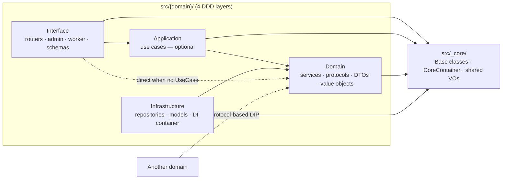
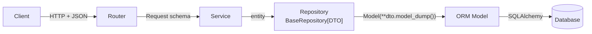

<p align="center">
  <picture>
    <source media="(prefers-color-scheme: dark)" srcset="docs/assets/logo-dark.png">
    <source media="(prefers-color-scheme: light)" srcset="docs/assets/logo-light.png">
    
  </picture>
</p>

<h1 align="center">FastAPI Agent Blueprint</h1>

<p align="center">
  <a href="https://github.com/Mr-DooSun/fastapi-agent-blueprint/actions/workflows/ci.yml"></a>
  <a href="https://www.python.org/downloads/"></a>
  <a href="https://fastapi.tiangolo.com"></a>
  <a href="LICENSE"></a>
  <a href="https://github.com/astral-sh/ruff"></a>
  <a href="https://github.com/Mr-DooSun/fastapi-agent-blueprint/stargazers"></a>
</p>

<p align="center">
  <b>Production-ready FastAPI blueprint for AI agent backends.</b><br>
  DDD layers · zero-boilerplate CRUD · auto domain discovery · multi-interface (API · worker · admin · MCP-ready) ·<br>
  vector / embedding / LLM infra · built-in AI dev skills for Claude Code &amp; Codex CLI.
</p>

<p align="center">
  <a href="#try-it-in-60-seconds">60s Quickstart</a>
  · <a href="#architecture-at-a-glance">Architecture</a>
  · <a href="#ai-native-development">AI Skills</a>
  · <a href="#how-it-compares">Comparison</a>
  · <a href="docs/README.ko.md">한국어</a>
</p>

<p align="center">
  <a href="https://github.com/Mr-DooSun/fastapi-agent-blueprint/generate">
    
  </a>
</p>

---

## Try it in 60 seconds

No Docker, no PostgreSQL, no cloud credentials — SQLite + in-memory broker.

```bash
git clone https://github.com/Mr-DooSun/fastapi-agent-blueprint.git
cd fastapi-agent-blueprint
make setup        # one-time: venv + deps via uv
make quickstart   # FastAPI on :8001, SQLite schema auto-created
```

In a second terminal, `make demo` exercises the `user` domain with `curl`:

```text
→ Health check
{ "status": "ok" }

→ Create a user
{ "success": true, "data": { "id": 1, "username": "alice",
                             "fullName": "Alice Liddell", ... } }

→ List users (page=1, pageSize=10)
{ "data": [ { "id": 1, "username": "alice", ... } ],
  "pagination": { "currentPage": 1, "totalItems": 1,
                  "hasNext": false, ... } }

→ Update the user    → Delete the user
→ Done. Swagger UI: http://127.0.0.1:8001/docs-swagger
```

- Swagger: <http://127.0.0.1:8001/docs-swagger>
- Admin UI: <http://127.0.0.1:8001/admin> (`admin` / `admin`)
- Full walkthrough: [`docs/quickstart.md`](docs/quickstart.md)
- Real dev stack (PostgreSQL + migrations): [`docs/reference.md`](docs/reference.md#local-development-with-postgresql)

---

## Why this blueprint

- **Write domain logic once, expose it everywhere.** HTTP (FastAPI) + worker (Taskiq) + admin (NiceGUI) share a single domain layer. MCP server is on the roadmap.
- **Zero-boilerplate CRUD.** Inherit `BaseRepository[DTO]` and `BaseService[Create, Update, DTO]` to get 7 async methods — including paginated list with `QueryFilter` — for free.
- **Auto domain discovery.** Drop a folder into `src/{name}/`, it auto-registers. No container edits, no bootstrap edits.
- **Pluggable infra, env-switchable.** PostgreSQL / MySQL / SQLite · DynamoDB · S3 / MinIO · S3 Vectors · SQS / RabbitMQ / InMemory · OpenAI / Bedrock for both LLM and embeddings.
- **Architecture enforced at commit time.** A pre-commit hook blocks `Domain → Infrastructure` imports so the DDD contract cannot rot.
- **AI-native workflows.** 14 Claude Code skills + 15 Codex CLI skills sharing one `AGENTS.md` rules file — scaffold a domain, add a route, or audit architecture with a single command.

---

## How it compares

| Feature | FastAPI Agent Blueprint | [tiangolo/full-stack](https://github.com/fastapi/full-stack-fastapi-template) | [s3rius/template](https://github.com/s3rius/FastAPI-template) | [teamhide/boilerplate](https://github.com/teamhide/fastapi-boilerplate) |
|---|:-:|:-:|:-:|:-:|
| Zero-boilerplate CRUD (7 methods) | **Yes** | No | No | No |
| Auto domain discovery | **Yes** | No | No | No |
| Architecture enforcement (pre-commit) | **Yes** | No | No | No |
| AI workflow skills (Claude + Codex) | **14 + 15** | 0 | 0 | 0 |
| Vector infrastructure (S3 Vectors) | **Yes** | No | No | No |
| Multi-interface (API + Worker + Admin + MCP) | **3 + 1 planned** | 2 | 1 | 1 |
| Architecture Decision Records | **40** | 0 | 0 | 0 |
| Type-safe generics across layers | **Yes** | Partial | Partial | No |
| IoC container DI | **Yes** | No | No | No |

---

## Architecture at a glance

Every domain under `src/{domain}/` has four DDD layers. Arrows mean
**"depends on"**. `Application` (use cases) is optional — the dotted
line is the common path for simple CRUD (Router → Service directly).



| Layer | Role | Base class |
|---|---|---|
| Interface | Router · Request/Response · Admin · Worker task | — |
| Domain | Service · Protocol · DTO · Exceptions | `BaseService[CreateDTO, UpdateDTO, ReturnDTO]` |
| Infrastructure | Repository · Model · DI container | `BaseRepository[ReturnDTO]` |
| Application | UseCase — optional orchestrator | — |

> Full set of diagrams (Layer · Write · Read) plus RDB / DynamoDB / S3
> Vectors variants lives in
> [`docs/ai/shared/architecture-diagrams.md`](docs/ai/shared/architecture-diagrams.md).
> Non-Mermaid viewers:
> [SVG exports](docs/assets/architecture/).

### Data flow — Write (`POST` / `PUT` / `DELETE`)



- **Request → Service** directly when fields match (no intermediate DTO — [ADR 004](docs/history/004-dto-entity-responsibility.md)).
- **Model ↔ DTO** conversion happens *only* inside the Repository.
- Read flow is the mirror image; the Router strips sensitive fields on the way out.

### Storage variants

Same flow, different base classes:

| Storage | Service base | Repository / Store base | List return |
|---|---|---|---|
| RDB (default) | `BaseService[Create, Update, DTO]` | `BaseRepository[DTO]` | `(list[DTO], PaginationInfo)` |
| DynamoDB | `BaseDynamoService[…]` | `BaseDynamoRepository[DTO]` | `CursorPage[DTO]` |
| S3 Vectors | domain-specific | `BaseS3VectorStore[DTO]` | `VectorSearchResult[DTO]` |

---

## Interfaces

One business logic, multiple surfaces:

| Interface | Tech | Status | Purpose |
|---|---|---|---|
| HTTP API | FastAPI | Stable | REST endpoints |
| Async worker | Taskiq + SQS / RabbitMQ / InMemory | Stable | Background jobs |
| Admin UI | NiceGUI | Stable | Auto-generated admin CRUD |
| MCP server | FastMCP | Planned ([#18](https://github.com/Mr-DooSun/fastapi-agent-blueprint/issues/18)) | AI agent tool interface |

---

## AI-native development

Both **Claude Code** and **OpenAI Codex CLI** are first-class. They share one rules file ([`AGENTS.md`](AGENTS.md)) and one workflow reference layer ([`docs/ai/shared/`](docs/ai/shared/)); tool-specific harnesses layer on top.

| | Claude Code | Codex CLI |
|---|---|---|
| Skills | 14 slash commands (`.claude/skills/`) | 15 workflow skills (`.agents/skills/`) |
| Config | `CLAUDE.md` + `.mcp.json` | `.codex/config.toml` + `.codex/hooks.json` |
| Hooks | PostToolUse auto-format | 6 hooks (format · security · session-start · …) |

### Your first domain in 10 minutes

```text
/onboard            # adaptive walkthrough — beginner to advanced
/new-domain product # scaffolds 15 source files + 25 __init__.py + 4 tests
/add-api "add GET /product/top-selling to product"
/review-architecture product
```

Swap `/` for `$` if you are on Codex CLI. Prefer no harness at all?
The [manual scaffolding walkthrough](docs/reference.md#manual-domain-scaffolding)
shows the exact three layers the skill produces.

Selected skills (all available in both tools): `onboard`, `new-domain`,
`add-api`, `add-worker-task`, `add-admin-page`, `review-architecture`,
`security-review`, `review-pr`, `plan-feature`, `fix-bug`.
Full table and setup guide: [`docs/ai-development.md`](docs/ai-development.md).

---

## Learn more

| I want to… | Read |
|---|---|
| Spin it up and poke around | [`docs/quickstart.md`](docs/quickstart.md) |
| Understand the architecture in depth | [`docs/ai/shared/architecture-diagrams.md`](docs/ai/shared/architecture-diagrams.md) · [`AGENTS.md`](AGENTS.md) |
| Set up Claude Code or Codex CLI | [`docs/ai-development.md`](docs/ai-development.md) |
| Add a domain by hand (no AI tools) | [`docs/reference.md#manual-domain-scaffolding`](docs/reference.md#manual-domain-scaffolding) |
| See detailed env vars, tech stack, project tree | [`docs/reference.md`](docs/reference.md) |
| Understand why a decision was made | [ADR index](docs/history/README.md) (40 records) |
| Follow what's next | [Roadmap](docs/reference.md#roadmap) · [issue tracker](https://github.com/Mr-DooSun/fastapi-agent-blueprint/issues) |

---

## Coming soon

- **MCP server interface** — expose domain services as agent tools via FastMCP ([#18](https://github.com/Mr-DooSun/fastapi-agent-blueprint/issues/18))
- **pgvector** — additional vector backend alongside S3 Vectors ([#11](https://github.com/Mr-DooSun/fastapi-agent-blueprint/issues/11))
- **JWT authentication** ([#4](https://github.com/Mr-DooSun/fastapi-agent-blueprint/issues/4)) · **Structured logging** ([#9](https://github.com/Mr-DooSun/fastapi-agent-blueprint/issues/9))

---

## Contributing

See [`CONTRIBUTING.md`](CONTRIBUTING.md) for dev setup, coding guidelines,
and the PR workflow. Newcomers — check the
[`good first issue`](https://github.com/Mr-DooSun/fastapi-agent-blueprint/issues?q=is%3Aopen+label%3A%22good+first+issue%22)
label.

## License

[MIT](LICENSE) — free for commercial use, modification, and distribution.

---

<p align="center">
<a href="https://star-history.com/#Mr-DooSun/fastapi-agent-blueprint&Date">
  <picture>
    <source media="(prefers-color-scheme: dark)" srcset="https://api.star-history.com/svg?repos=Mr-DooSun/fastapi-agent-blueprint&type=Date&theme=dark" />
    <source media="(prefers-color-scheme: light)" srcset="https://api.star-history.com/svg?repos=Mr-DooSun/fastapi-agent-blueprint&type=Date" />
    
  </picture>
</a>
</p>
