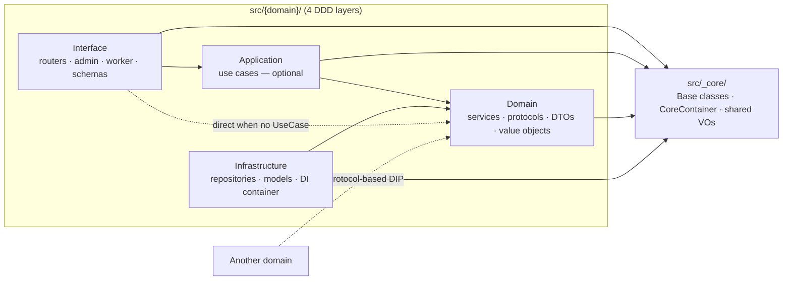
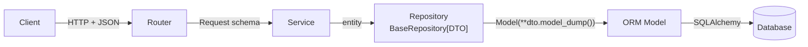
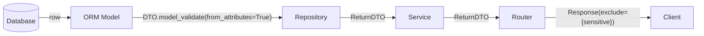

<p align="center">
  <picture>
    <source media="(prefers-color-scheme: dark)" srcset="docs/assets/logo-dark.png">
    <source media="(prefers-color-scheme: light)" srcset="docs/assets/logo-light.png">
    
  </picture>
</p>

<h1 align="center">FastAPI Agent Blueprint</h1>

<p align="center">
  <a href="https://github.com/Mr-DooSun/fastapi-agent-blueprint/actions/workflows/ci.yml"></a>
  <a href="https://www.python.org/downloads/"></a>
  <a href="https://fastapi.tiangolo.com"></a>
  <a href="LICENSE"></a>
  <a href="https://github.com/astral-sh/ruff"></a>
  <a href="https://github.com/Mr-DooSun/fastapi-agent-blueprint/stargazers"></a>
</p>

<p align="center">
  <b>FastAPI DDD template, built for AI agent backends.</b><br>
  Zero-boilerplate CRUD + auto discovery + vector search today. MCP server + AI orchestration coming soon.<br>
  14+ AI development skills for Claude Code &amp; Codex CLI.
</p>

<p align="center">
  <a href="#quick-start">Quick Start</a> · <a href="#who-is-this-for">Who is this for?</a> · <a href="#architecture">Architecture</a> · <a href="#comparison">Comparison</a> · <a href="docs/README.ko.md">한국어</a>
</p>

<p align="center">
  <a href="https://github.com/Mr-DooSun/fastapi-agent-blueprint/generate">
    
  </a>
</p>

---

## Who is this for?

- **FastAPI developers** who need a production-ready project structure beyond the tutorial stage — DDD layers, DI container, async throughout, architecture enforcement
- **Backend teams** building systems that need multiple interfaces (REST API + background workers + admin UI) sharing the same domain logic
- **AI agent builders** who need vector search and embedding infrastructure ready out of the box, with MCP server and PydanticAI orchestration coming soon
- **AI-augmented developers** who use Claude Code or Codex CLI and want a codebase with 14+ built-in AI development skills that work in both tools

---

## What You Get

- **Zero-boilerplate CRUD** — Inherit `BaseRepository[DTO]` + `BaseService[Create, Update, DTO]`, get 7 async methods instantly
- **Auto domain discovery** — Add a domain folder, it auto-registers. No container or bootstrap changes
- **3 interface types** — HTTP API (FastAPI) + Async Worker (Taskiq) + Admin UI (NiceGUI), all sharing one domain layer
- **Pluggable infrastructure** — PostgreSQL/MySQL/SQLite, DynamoDB, S3/MinIO, SQS/RabbitMQ, OpenAI/Bedrock — switch by env var
- **Vector infrastructure** — S3 Vectors + OpenAI/Bedrock embeddings + semantic chunking utilities
- **Type-safe generics** — `BaseRepository[ProductDTO]`, `BaseService[CreateProductRequest, UpdateProductRequest, ProductDTO]`, `SuccessResponse[ProductResponse]`
- **Architecture enforcement** — Pre-commit hooks block `Domain → Infrastructure` imports at commit time
- **DynamoDB support** — `BaseDynamoRepository` with cursor-based pagination alongside PostgreSQL
- **14+ AI development skills** — Works in both Claude Code and Codex CLI: `new-domain`, `add-api`, `onboard`, `review-architecture`, and more ([details](#ai-native-development))
- **Async-first** — From DB (asyncpg) to HTTP (aiohttp) to task queue (Taskiq)
- **37 ADRs** — Every technical choice documented with rationale ([view index](docs/history/README.md))

<details>
<summary><b>Coming soon</b></summary>

- **MCP Server interface** — Expose domain services as AI agent tools via FastMCP ([#18](https://github.com/Mr-DooSun/fastapi-agent-blueprint/issues/18))
- **PydanticAI integration** — Structured LLM orchestration with Pydantic-native outputs ([#15](https://github.com/Mr-DooSun/fastapi-agent-blueprint/issues/15))
- **pgvector** — Additional vector backend ([#11](https://github.com/Mr-DooSun/fastapi-agent-blueprint/issues/11))

</details>

---

## Quick Start

### 60-second evaluation (no Docker, no Postgres, no credentials)

```bash
git clone https://github.com/Mr-DooSun/fastapi-agent-blueprint.git
cd fastapi-agent-blueprint
make setup        # one-time: create venv + install deps
make quickstart   # boots FastAPI on SQLite + InMemory broker
```

Open http://127.0.0.1:8001/docs-swagger. In another terminal, `make demo`
runs a full CRUD walkthrough against the `user` domain.

Full details: [`docs/quickstart.md`](docs/quickstart.md).

### Real local development (PostgreSQL + migrations)

```bash
# 1. Clone
git clone https://github.com/Mr-DooSun/fastapi-agent-blueprint.git
cd fastapi-agent-blueprint

# 2. Setup (requires uv)
make setup

# 3. Set up environment variables
cp _env/local.env.example _env/local.env

# 4. Start PostgreSQL + run migrations + start server
make dev
```

Open http://localhost:8000/docs-swagger to explore the API.

<details>
<summary>Manual setup (without Make)</summary>

```bash
# 2. Create virtual environment + install dependencies
uv venv --python 3.12
source .venv/bin/activate
uv sync --group dev

# 3. Set up environment variables
cp _env/local.env.example _env/local.env

# 4. Start PostgreSQL (Docker)
docker compose -f docker-compose.local.yml up -d postgres

# 5. Run migrations + start server
alembic upgrade head
python run_server_local.py --env local
```
</details>

---

## Why?

### Your domain logic — accessible everywhere

Write business logic once. Expose it as a REST API, background job, admin view, or AI agent tool.

```python
# 1. Define your service
class DocumentService(
    BaseService[CreateDocumentRequest, UpdateDocumentRequest, DocumentDTO]
):
    async def analyze(self, document_id: int) -> AnalysisDTO:
        ...  # your business logic

# 2. REST API — for your frontend
@router.post("/documents/{document_id}/analyze")
async def analyze_document(document_id: int, service=Depends(...)):
    return await service.analyze(document_id)

# 3. MCP Tool — for AI agents (coming soon)
@mcp.tool()
async def analyze_document(document_id: int) -> AnalysisResult:
    return await document_service.analyze(document_id)

# 4. Background job — for batch processing
@broker.task()
async def batch_analyze(project_id: int):
    for doc in await service.get_by_project(project_id):
        await service.analyze(doc.id)
```

### Zero-boilerplate CRUD

```python
# Before: Repeat the same CRUD for every domain
@router.post("/user")
async def create_user(user: UserCreate):
    db = get_db()
    new_user = User(**user.dict())
    db.add(new_user)
    db.commit()
    return new_user

@router.post("/product")  # Repeat again...
async def create_product(product: ProductCreate):
    db = get_db()
    new_product = Product(**product.dict())
    db.add(new_product)
    db.commit()
    return new_product
```

```python
# After: One inheritance line, CRUD done
class ProductRepository(BaseRepository[ProductDTO]):
    def __init__(self, database: Database):
        super().__init__(database=database, model=ProductModel, return_entity=ProductDTO)

class ProductService(BaseService[CreateProductRequest, UpdateProductRequest, ProductDTO]):
    def __init__(self, product_repository: ProductRepositoryProtocol):
        super().__init__(repository=product_repository)

# Core CRUD methods and pagination helpers are provided automatically
```

---

## Architecture

Arrow direction = **"depends on"**. Domain sits at the center; Interface
and Infrastructure point inward. UseCase is optional — the dotted bypass
line is the common path for simple CRUD.



> **Deep dive:** [`docs/ai/shared/architecture-diagrams.md`](docs/ai/shared/architecture-diagrams.md)
> (canonical diagrams + full variant table for RDB / DynamoDB / S3 Vectors).

### Layer Responsibilities

| Layer | Role | Base Class |
|-------|------|-----------|
| **Interface** | Router, Request/Response, Admin, Worker Task, MCP Tool | - |
| **Domain** | Service (business logic), Protocol, DTO, Exceptions | `BaseService[CreateDTO, UpdateDTO, ReturnDTO]` |
| **Infrastructure** | Repository (DB access), Model, DI Container | `BaseRepository[ReturnDTO]` |
| **Application** | UseCase (orchestration) -- **optional** | - |

### Data Flow

**Write** — `POST` / `PUT` / `DELETE`



**Read** — `GET`



- Request passes directly to Service when fields match (no extra DTO)
- Repository owns the single Model ↔ DTO conversion boundary
- Router strips sensitive fields (`password`, etc.) at the Response edge

### Storage Variants

Same flow shape across all three storage backends — only the base classes
and persistence types change.

| Storage | Service base | Repo / Store base | Persistence | List return |
|---|---|---|---|---|
| RDB (default) | `BaseService[Create, Update, DTO]` | `BaseRepository[DTO]` | ORM `Model(Base)` | `(list[DTO], PaginationInfo)` |
| DynamoDB | `BaseDynamoService[...]` | `BaseDynamoRepository[DTO]` | `DynamoModel` | `CursorPage[DTO]` |
| S3 Vectors | domain-specific | `BaseS3VectorStore[DTO]` | `S3VectorModel` | `VectorSearchResult[DTO]` |

### Data Objects

| Object | Role | Location |
|--------|------|----------|
| **Request/Response** | API contract | `interface/server/schemas/` |
| **DTO** | Internal data transfer between layers | `domain/dtos/` |
| **Model** | DB table mapping (never exposed outside Repository) | `infrastructure/database/models/` |

---

## Interface Types

Each domain can expose functionality through multiple interfaces:

| Interface | Technology | Status | Purpose |
|-----------|-----------|--------|---------|
| **HTTP API** | FastAPI | Stable | REST API endpoints |
| **Async Worker** | Taskiq + SQS/RabbitMQ/InMemory | Stable | Background task processing |
| **Admin UI** | NiceGUI | Stable | Auto-discovered admin CRUD dashboard |
| **MCP Server** | FastMCP | Planned | AI agent tool interface |

All interfaces share the same Domain and Infrastructure layers -- write your business logic once, expose it everywhere.

---

## AI-Native Development

This template includes built-in AI collaboration support for **Claude Code** and **OpenAI Codex CLI**. Both tools share the same architecture rules (`AGENTS.md`) and workflow references (`docs/ai/shared/`), with tool-specific harnesses layered on top.

| Layer | Claude Code | Codex CLI |
|-------|------------|-----------|
| **Shared rules** | `AGENTS.md` | `AGENTS.md` |
| **Shared references** | `docs/ai/shared/` | `docs/ai/shared/` |
| **Tool config** | `CLAUDE.md` + `.mcp.json` | `.codex/config.toml` + `.codex/hooks.json` |
| **Skills** | 14 slash commands (`.claude/skills/`) | 15 workflow skills (`.agents/skills/`) |
| **Hooks** | PostToolUse auto-format | 6 hooks (format, security, session-start, ...) |

### Zero Learning Curve

Complex architecture? Type `/onboard` (Claude) or `$onboard` (Codex) -- it explains everything at your level.

The onboard skill adapts to your experience and learning style:
- **Beginner / Intermediate / Advanced** -- depth adjusts to your level
- **Guided** -- structured Phase-by-Phase walkthrough
- **Q&A** -- topic maps provided, explore by asking questions
- **Explore** -- point at any code freely, uncovered essentials flagged at the end

### Built-in Skills

All skills work in both Claude Code (`/` prefix) and Codex CLI (`$` prefix):

| Skill | What it does |
|-------|------------|
| `onboard` | Interactive onboarding -- adapts to your experience level and learning style |
| `new-domain {name}` | Scaffold an entire domain (21+ source files + tests) |
| `add-api {description}` | Add API endpoint to existing domain |
| `add-worker-task {domain} {task}` | Add async Taskiq background task |
| `add-admin-page {domain}` | Add a NiceGUI admin page to an existing domain |
| `add-cross-domain from:{a} to:{b}` | Wire cross-domain dependency via Protocol DIP |
| `plan-feature {description}` | Requirements interview -> architecture -> security -> task breakdown |
| `review-architecture {domain}` | Architecture compliance audit (20+ checks) |
| `security-review {domain}` | OWASP-based security audit |
| `test-domain {domain}` | Generate or run domain tests |
| `fix-bug {description}` | Structured bug fixing workflow |
| `review-pr {number}` | Architecture-aware PR review |
| `sync-guidelines` | Sync docs after design changes |
| `migrate-domain {command}` | Alembic migration management |

> For plugin setup, MCP server configuration, and Codex CLI details, see the [AI Development Guide](docs/ai-development.md).

---

## Comparison

| Feature | FastAPI Agent Blueprint | [tiangolo/full-stack](https://github.com/fastapi/full-stack-fastapi-template) | [s3rius/template](https://github.com/s3rius/FastAPI-template) | [teamhide/boilerplate](https://github.com/teamhide/fastapi-boilerplate) |
|---------|:-:|:-:|:-:|:-:|
| Zero-boilerplate CRUD (7 methods) | **Yes** | No | No | No |
| Auto domain discovery | **Yes** | No | No | No |
| Architecture enforcement (pre-commit) | **Yes** | No | No | No |
| AI workflow skills (Claude + Codex) | **14+** | 0 | 0 | 0 |
| Vector infrastructure (S3 Vectors) | **Yes** | No | No | No |
| Adaptive onboarding (`/onboard`) | **Yes** | No | No | No |
| Multi-interface (API+Worker+Admin+MCP) | **3+1 planned** | 2 | 1 | 1 |
| Architecture Decision Records | **37** | 0 | 0 | 0 |
| Type-safe generics across layers | **Yes** | Partial | Partial | No |
| DI with IoC Container | **Yes** | No | No | No |
| MCP Server interface | **Planned** | No | No | No |
| AI orchestration (PydanticAI) | **Planned** | No | No | No |

---

## Adding a New Domain

> With Claude Code, just run `/new-domain product` to scaffold all of this automatically.

<details>
<summary>Manual steps (Product domain example)</summary>

### 1. Domain Layer

```python
# src/product/domain/dtos/product_dto.py
class ProductDTO(BaseModel):
    id: int = Field(..., description="Product ID")
    name: str = Field(..., description="Product name")
    price: int = Field(..., description="Price")
    created_at: datetime
    updated_at: datetime

# src/product/domain/protocols/product_repository_protocol.py
class ProductRepositoryProtocol(BaseRepositoryProtocol[ProductDTO]):
    pass

# src/product/domain/services/product_service.py
class ProductService(
    BaseService[CreateProductRequest, UpdateProductRequest, ProductDTO]
):
    def __init__(self, product_repository: ProductRepositoryProtocol):
        super().__init__(repository=product_repository)
    # CRUD provided automatically. Just add custom logic.
```

### 2. Infrastructure Layer

```python
# src/product/infrastructure/database/models/product_model.py
class ProductModel(Base):
    __tablename__ = "product"
    id: Mapped[int] = mapped_column(Integer, primary_key=True)
    name: Mapped[str] = mapped_column(String(255), nullable=False)
    price: Mapped[int] = mapped_column(Integer, nullable=False)
    created_at: Mapped[datetime] = mapped_column(DateTime, server_default=func.now())
    updated_at: Mapped[datetime] = mapped_column(DateTime, onupdate=func.now())

# src/product/infrastructure/repositories/product_repository.py
class ProductRepository(BaseRepository[ProductDTO]):
    def __init__(self, database: Database):
        super().__init__(database=database, model=ProductModel, return_entity=ProductDTO)

# src/product/infrastructure/di/product_container.py
class ProductContainer(containers.DeclarativeContainer):
    core_container = providers.DependenciesContainer()
    product_repository = providers.Singleton(ProductRepository, database=core_container.database)
    product_service = providers.Factory(ProductService, product_repository=product_repository)
```

### 3. Interface Layer

```python
# src/product/interface/server/routers/product_router.py
@router.post("/product", response_model=SuccessResponse[ProductResponse])
@inject
async def create_product(
    item: CreateProductRequest,
    product_service: ProductService = Depends(Provide[ProductContainer.product_service]),
) -> SuccessResponse[ProductResponse]:
    data = await product_service.create_data(entity=item)
    return SuccessResponse(data=ProductResponse(**data.model_dump()))
```

### Auto Registration

`discover_domains()` automatically detects new domains.
**No changes needed** in `_apps/` containers or bootstrap files.

Discovery conditions:
- `src/{name}/__init__.py` exists
- `src/{name}/infrastructure/di/{name}_container.py` exists

</details>

---

## Tech Stack

FastAPI + SQLAlchemy 2.0 + Pydantic 2.x + dependency-injector + Taskiq + NiceGUI + asyncpg + aioboto3

<details>
<summary>Full stack details</summary>

### AI & Agent

| Technology | Purpose | Status |
|-----------|---------|--------|
| **AWS S3 Vectors** | Managed vector index backend for semantic search infrastructure | Available |
| **OpenAI / Bedrock Embeddings** | Pluggable embedding backends selected by configuration | Available |
| **FastMCP** | MCP server — expose domain services as tools for AI agents | Planned |
| **PydanticAI** | Structured LLM orchestration with Pydantic-native outputs | Planned |

### Core

| Technology | Purpose |
|-----------|---------|
| **FastAPI** | Async web framework |
| **Pydantic** 2.x | Data validation & settings |
| **SQLAlchemy** 2.0 | Async ORM |
| **dependency-injector** | IoC Container ([why?](docs/history/013-why-ioc-container.md)) |

### Infrastructure

| Technology | Purpose |
|-----------|---------|
| **PostgreSQL** + asyncpg | Primary RDBMS |
| **Taskiq** + AWS SQS | Async task queue ([why not Celery?](docs/history/001-celery-to-taskiq.md)) |
| **aiohttp** | Async HTTP client |
| **aioboto3** | DynamoDB, S3/MinIO, S3 Vectors, and Bedrock clients |
| **semantic-text-splitter** | Character/token chunking utilities for embedding preprocessing |
| **Alembic** | DB migrations |

### DevOps

| Technology | Purpose |
|-----------|---------|
| **Ruff** | Linting + formatting ([replaces 6 tools](docs/history/012-ruff-migration.md)) |
| **pre-commit** | Git hook automation + architecture enforcement |
| **UV** | Python package management ([why not Poetry?](docs/history/005-poetry-to-uv.md)) |
| **NiceGUI** | Admin dashboard UI |

</details>

---

## Project Structure

<details>
<summary>View full project tree</summary>

```
src/
├── _apps/                        # App entry points
│   ├── server/                  # FastAPI HTTP server
│   ├── worker/                  # Taskiq async worker
│   └── admin/                   # NiceGUI admin app
│
├── _core/                        # Shared infrastructure
│   ├── common/                  # Pagination, security, text utils, UUID helpers
│   ├── domain/
│   │   ├── protocols/           # BaseRepositoryProtocol[ReturnDTO]
│   │   └── services/            # BaseService[CreateDTO, UpdateDTO, ReturnDTO]
│   ├── infrastructure/
│   │   ├── database/            # Database, BaseRepository[ReturnDTO]
│   │   ├── dynamodb/            # DynamoDBClient, BaseDynamoRepository
│   │   ├── embedding/           # OpenAI/Bedrock embedding clients
│   │   ├── http/                # HttpClient, BaseHttpGateway
│   │   ├── s3vectors/           # S3VectorClient, BaseS3VectorStore
│   │   ├── taskiq/              # Broker adapters, TaskiqManager
│   │   ├── storage/             # S3/MinIO
│   │   ├── di/                  # CoreContainer
│   │   └── discovery.py         # Auto domain discovery
│   ├── application/dtos/        # BaseRequest, BaseResponse, SuccessResponse
│   ├── exceptions/              # Exception handlers, BaseCustomException
│   └── config.py                # Settings (pydantic-settings)
│
├── user/                         # Example domain
│   ├── domain/
│   │   ├── dtos/                # UserDTO
│   │   ├── protocols/           # UserRepositoryProtocol
│   │   ├── services/            # UserService(BaseService[CreateUserRequest, UpdateUserRequest, UserDTO])
│   │   ├── exceptions/          # UserNotFoundException
│   ├── infrastructure/
│   │   ├── database/models/     # UserModel
│   │   ├── repositories/        # UserRepository(BaseRepository[UserDTO])
│   │   └── di/                  # UserContainer
│   └── interface/
│       ├── server/              # routers/, schemas/, bootstrap/
│       ├── worker/              # payloads/, tasks/, bootstrap/
│       └── admin/               # configs/, pages/ (NiceGUI)
│
├── migrations/                   # Alembic
├── _env/                         # Environment variables
└── docs/history/                 # Architecture Decision Records
```

</details>

---

## Architecture Decisions

Every technical choice in this project is documented as an ADR (Architecture Decision Record). [View all 37 ADRs →](docs/history/README.md)

<details>
<summary>Key decisions</summary>

| # | Title |
|---|-------|
| [004](docs/history/004-dto-entity-responsibility.md) | DTO/Entity responsibility redefined |
| [006](docs/history/006-ddd-layered-architecture.md) | Domain-driven layered architecture |
| [007](docs/history/007-di-container-and-app-separation.md) | DI container hierarchy and app separation |
| [011](docs/history/011-3tier-hybrid-architecture.md) | 3-Tier hybrid architecture |
| [012](docs/history/012-ruff-migration.md) | Ruff adoption |
| [013](docs/history/013-why-ioc-container.md) | Why IoC Container over inheritance |

</details>

---

## Roadmap

### Phase 1: AI Agent Foundation
- [ ] FastMCP interface ([#18](https://github.com/Mr-DooSun/fastapi-agent-blueprint/issues/18))
- [ ] PydanticAI integration ([#15](https://github.com/Mr-DooSun/fastapi-agent-blueprint/issues/15))
- [ ] Additional vector backend: pgvector ([#11](https://github.com/Mr-DooSun/fastapi-agent-blueprint/issues/11))
- [ ] JWT authentication ([#4](https://github.com/Mr-DooSun/fastapi-agent-blueprint/issues/4))

### Phase 2: Production Readiness
- [ ] Structured logging — structlog ([#9](https://github.com/Mr-DooSun/fastapi-agent-blueprint/issues/9))
- [ ] Error notifications ([#17](https://github.com/Mr-DooSun/fastapi-agent-blueprint/issues/17))
- [ ] CRUD data validation ([#10](https://github.com/Mr-DooSun/fastapi-agent-blueprint/issues/10))

### Phase 3: Ecosystem
- [ ] Test coverage expansion ([#2](https://github.com/Mr-DooSun/fastapi-agent-blueprint/issues/2))
- [ ] Performance testing — Locust ([#3](https://github.com/Mr-DooSun/fastapi-agent-blueprint/issues/3))
- [ ] Serverless deployment ([#6](https://github.com/Mr-DooSun/fastapi-agent-blueprint/issues/6))
- [ ] WebSocket documentation ([#1](https://github.com/Mr-DooSun/fastapi-agent-blueprint/issues/1))

### Completed
- [x] Storage abstraction — S3/MinIO switchable via env var ([#58](https://github.com/Mr-DooSun/fastapi-agent-blueprint/issues/58))
- [x] Embedding service — OpenAI/Bedrock switchable ([#69](https://github.com/Mr-DooSun/fastapi-agent-blueprint/issues/69))
- [x] S3 Vectors support ([#11](https://github.com/Mr-DooSun/fastapi-agent-blueprint/issues/11))
- [x] DynamoDB support ([#13](https://github.com/Mr-DooSun/fastapi-agent-blueprint/issues/13))
- [x] Broker abstraction — SQS/RabbitMQ/InMemory ([#8](https://github.com/Mr-DooSun/fastapi-agent-blueprint/issues/8))
- [x] Admin dashboard — NiceGUI ([#14](https://github.com/Mr-DooSun/fastapi-agent-blueprint/issues/14))
- [x] Per-environment config ([#7](https://github.com/Mr-DooSun/fastapi-agent-blueprint/issues/7), [#16](https://github.com/Mr-DooSun/fastapi-agent-blueprint/issues/16), [#53](https://github.com/Mr-DooSun/fastapi-agent-blueprint/issues/53))
- [x] Worker payload schemas ([#37](https://github.com/Mr-DooSun/fastapi-agent-blueprint/issues/37))
- [x] CHANGELOG ([#41](https://github.com/Mr-DooSun/fastapi-agent-blueprint/issues/41))
- [x] 14+ AI development skills for Claude Code and Codex CLI
- [x] Codex CLI workflow layer
- [x] Health check endpoint
- [x] Auto domain discovery
- [x] Architecture enforcement (pre-commit)

Star this repo to follow our progress!

---

## Contributing

See [CONTRIBUTING.md](CONTRIBUTING.md) for development setup, coding guidelines, and PR process.

---

## License

[MIT License](LICENSE) -- Free for commercial use, modification, and distribution.

---

## Star History

<a href="https://star-history.com/#Mr-DooSun/fastapi-agent-blueprint&Date">
 <picture>
   <source media="(prefers-color-scheme: dark)" srcset="https://api.star-history.com/svg?repos=Mr-DooSun/fastapi-agent-blueprint&type=Date&theme=dark" />
   <source media="(prefers-color-scheme: light)" srcset="https://api.star-history.com/svg?repos=Mr-DooSun/fastapi-agent-blueprint&type=Date" />
   
 </picture>
</a>
