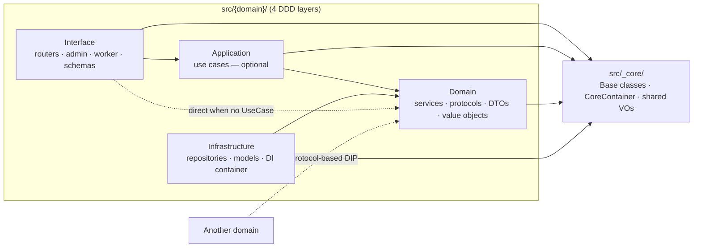
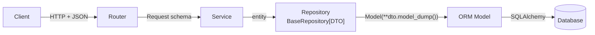
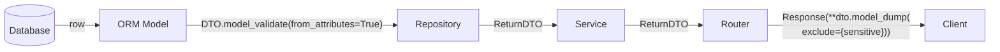

# Visual Architecture Reference

> Canonical Mermaid diagrams for layer dependencies and runtime data flow.
> README / Korean README / `project-dna.md` / onboarding skill all reference
> this file. Update the diagrams here when the architecture changes, then
> confirm nothing downstream needs a matching edit.

## 1. Layer Dependency

Arrow direction = **"depends on"**: the tail imports from / is aware of the
head. Domain sits at the center; Interface and Infrastructure both point
inward.



- **UseCase is optional.** Simple CRUD routes Router → Service directly
  (dotted bypass line). Add UseCase only when combining multiple services
  or orchestrating transactions — ADR 011.
- **`_core` holds framework primitives.** BaseService, BaseRepository,
  BaseDynamoRepository, BaseS3VectorStore, CoreContainer, shared value
  objects. Every layer may import from it.
- **Cross-domain access goes through Protocol.** A domain declares its
  public contract in `domain/protocols/` and other domains depend on the
  protocol — never on the concrete repository.
- **Forbidden edges:** `domain/ → infrastructure/`, `domain/ → interface/`.
  Pre-commit hooks block the first; conventions block the second.

## 2. Runtime Data Flow (RDB default)

### Write — `POST` / `PUT` / `DELETE`



### Read — `GET`



- **Conversion boundaries** (numbered steps in `project-dna.md` §6):
  Request → Service (direct pass when fields match),
  Service → Repository (typed `entity`),
  Repository ↔ Model (`model_dump()` out, `model_validate(from_attributes=True)` in),
  Router → Response (`exclude` sensitive fields like `password`).
- **Models never leave the Repository.** The `model_validate(...)` step is
  the only place the ORM/DynamoDB/Vector model becomes a DTO.

## 3. Storage Variants

The flow shape (Client → Router → Service → Repository/Store → Model →
storage) is identical across all three storage variants. Only the base
classes, persistence object, and list/query value objects change — this
is what the generics encode.

| Storage | Service base | Repository / Store base | Persistence object | Query input | List return |
|---|---|---|---|---|---|
| **RDB** (default) | `BaseService[Create, Update, DTO]` | `BaseRepository[DTO]` | ORM `Model(Base)` | `QueryFilter` | `(list[DTO], PaginationInfo)` |
| **DynamoDB** | `BaseDynamoService[Create, Update, DTO]` | `BaseDynamoRepository[DTO]` | `DynamoModel` | `DynamoKey` + `filter_expression` | `CursorPage[DTO]` |
| **S3 Vectors** | domain-specific | `BaseS3VectorStore[DTO]` | `S3VectorModel` | `VectorQuery(vector, top_k, filters)` | `VectorSearchResult[DTO]` |

- **RDB** uses offset pagination (`page`, `page_size`). Use `QueryFilter`
  for sort/search combinations.
- **DynamoDB** uses cursor pagination — DynamoDB does not support offset.
  `CursorPage[DTO]` carries both items and the opaque next-page cursor.
- **S3 Vectors** is a similarity-search API; the return carries distances
  alongside items. Upsert accepts an `Entity`, not a typed Create DTO.

## 4. Keep in Sync

- Base class import paths: `project-dna.md` §2
- Generic type signatures: `project-dna.md` §3
- CRUD method signatures: `project-dna.md` §4
- DI pattern (including `providers.Selector` for broker): `project-dna.md` §5
- Conversion patterns (with explicit examples): `project-dna.md` §6
- Detailed prohibitions (ADR 004, ADR 011): `AGENTS.md` Absolute Prohibitions

## 5. Static SVG Exports (non-Mermaid viewers)

GitHub, IDE Markdown previews, and most modern viewers render the Mermaid
blocks above natively. For clients that do not (Claude Code / Codex CLI
terminals, plain text readers, some in-editor chat UIs), an SVG copy of
every block is committed alongside this doc:

- [`docs/assets/architecture/01-layer-dependency.svg`](../../assets/architecture/01-layer-dependency.svg)
- [`docs/assets/architecture/02-write-post-put-delete.svg`](../../assets/architecture/02-write-post-put-delete.svg)
- [`docs/assets/architecture/03-read-get.svg`](../../assets/architecture/03-read-get.svg)

To regenerate after editing this file:

```bash
make diagrams
```

The Makefile target runs [`scripts/render-diagrams.sh`](../../../scripts/render-diagrams.sh),
which extracts every Mermaid block in order and renders it via
`@mermaid-js/mermaid-cli` (fetched on demand via `npx`). Keep the
committed SVGs in sync with the Mermaid source — treat a Mermaid edit
without a matching `make diagrams` run as an incomplete change.
